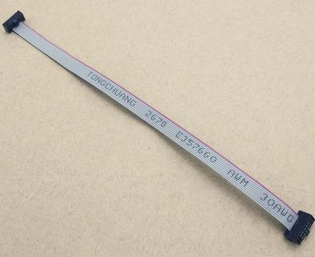
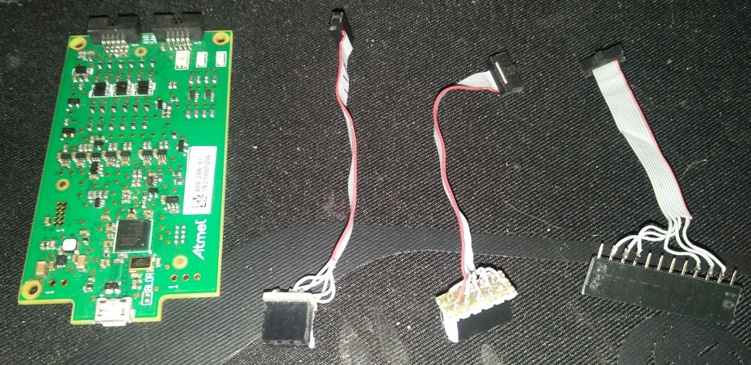

# Using Microchip Studio With Arduino Projects

## Why????

Sorry I use Windows a lot, and I wanted a way to use a debugger with Arduino projects. I know that I can use gdb or PlatformIo or something more open source,
but I'm on Windows so I use Microchip Studio, formerly known as Atmel Studio. This allows me to import a basic Arduino project with all the core and libraries, 
and use a debugger to step through the code, read variables, etc. 

## Debugger

I use the Atmel "Atmel-ICE " debugger, here's the product page: https://www.microchip.com/DevelopmentTools/ProductDetails/ATATMEL-ICE. I have the 
version without the plastic case, I've never blown one up and it's half the cost. It will program and debug all of Atmel's devices, both the ARM and the AVR
architectures.

The only problem is that the 10 pin headers that they have used are the small version with pins on a 50mil (0.05", 1.27mm) grid _and_ they have got the pins
backwards, so the pin that would normally be pin 1 is actually pin 10! Somehow _someone_ thought that this was a good idea. You can buy an adaptor board 
from Microchip, but I prefer to make my own.

## Connections

I buy a complete assemblies of two 50mil pitch 10 pin female headers with 15cm cable from Aliexpress for AUD14.77 for 10. The title on Aliexpress is 
"10pcs 15Cm 10-Pin 1.27mm Pitch IDC Socket Extension Flat Ribbon Cable Wire for ISP JTAG". 

I then cut these in half and make adaptors by soldering onto the wire ends. Here's a little rogues callery of the various styles of adaptors. 

I'm not documenting these beyond giving a table of where the various signals end up on the ribbon cable. Note that I count pin 1 from the stripe on the 
cable, so it accounts for Atmel's bizarre reversal of the connector. 
**Please don't rely on these connections, check them out with other sources. I haven't verified these properly.**

PIN | JTAG   | ISP/DebugWire
 1  | TCK    |       
 2  | GND    | MOSI
 3  | TDO    |       
 4  | VCC    |       
 5  | TMS    | RESET
 6  | RESET  |       
 7  | (NC)   | VCC   
 8  | (TRST) | GND   
 9  | TDI    | MISO  
 10 | GND    | SCK   
 
 You can check that the adaptor cable works with the "Device Programming" dialog box on Microchip Studio accessed by menu "Tools->Device Programming".
 Simply select your debugger, target processor and interface, then click the Apply button. If it can connect to the debugger then there will be no errors.
 Now click the "Read" button for "Target Voltage", you should see the correct voltage being displayed. If so, try clicking the "Read" button for 
 "Device Signature". You _should_ see the 24bit signature displayed. If not, there maight be an error with your wiring, or perhaps you don't have the 
 correct interface enabled with the device fuses. The smaller parts like the ATMEGA328P in particular have the DebugWire interface which uses the RESET 
 pin to  communicate with the processor, so enabling it in the fuses can effectively disable the ISP interface, which uses the SPI pins (MOSI, MISO, SCK)
 _and_ the RESET pin. So if DebugWire _has_ been enabled, then you might have to connect with the debugger.
 
## Creating your project for Debugging

I suggest starting with a very simply example Arduino project, such as the Blinky example. If you do a Google search for "arduino project microchip studio"
and do some reading, there are some good guides there. I would miss the video from Microchip. Be aware that you will end up with a large quantity of files that are simply copied from the Arduino core and library, personally I do not check this mess in.

Here's how to do it. 

0. Make sure that your project _builds_ in the Arduino environment.

1. Make sure that you know the location on the filesystem of the Arduino project that you want to debug. Make sure that you include all the libraries that you will need at any point in the development, even if they will not be required for the final project, as there is no way to add Arduino libraries to the Microchip Studio project, and you will have to go through this all again.

2. Start a new project with menu File -> New -> Project, and select option "Create project from Arduino sketch". See ![atmel-studio-new-arduino-project-dialog.png]

3. Set the *Name* of the new project, I usually set it to the same as the Arduino sketch, but with 'as-' leading the name, e.g 'foo' turns into 'as-foo'. This allows an easy rule for gitignore files to ignore all dirs matching the pattern 'as*/'.

4. Set the *Location* of the project, this is up to you but I choose the directory _containing_ the original Arduino sketch. This keeps them associated.

5. Make sure that the *Solution* dropdown is set to "Create New Solution", and that the *Create directory for solution" box is _not_ ticked.

6. Click OK, you should now see _another_ dialog, like this: ![create-cpp-project-from-arduino-sketch-dialog.png]

7. Set the *Sketch File* to the full path to your sketch file, which will have extension '.ino'. I have to copy the path in by selecting it in Windows Explorer as Atmel Studio crashes if I use the *...* button to browse.

8. Make sure that the *Arduino IDE PAth* box is correct, it always seems to be for me.

9. Select your *Board* & *Device* on the dropdown lists. For some reason Atmel Studio gets the Board right but gives up on Device.

10. Click *OK*. This takes some time as it copies hundreds of files.

11. Have a look at the monster that you have created! Look in the project directory you selected first off. There will be a file `as-<sketch>.atsln` which is the Atmel Studio solution file, that contains references to the two projects that Atmel Studio has created. There will also be a directory `as-<sketch>` containing the two project directories named `Arduino-Core` and `<sketch>`.

12. I do this because it keeps things nicely associated. Move the `as-<sketch>.atsln` file _into_ the `as-<sketch>` directory. OPen it up with a text editor. *Do not* double click it, this will open up Atmel Studio. Edit the two lines referring to project files with extension '.cppproj'. Don't forget to save it.

`as-<sketch>\<sketch>\<sketch>.cppproj` -> `<sketch>\<sketch>.cppproj`
`as-<sketch>\Arduino-Core\Arduino-Core.cppproj` -> `Arduino-Core\Arduino-Core.cppproj`

13. Now you can double click on the solution file, and Atmel Studio should start.

14. Now we set some sensible build options before we do a build. Did you know that Arduino runs gcc with warnings turned off? Shocking! Personally I enable every warning I can, this actually finds some bugs in third party libraries, mostly due to Arduino AVR gcc being somewhat older version that the gcc used for ARM. 

